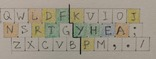
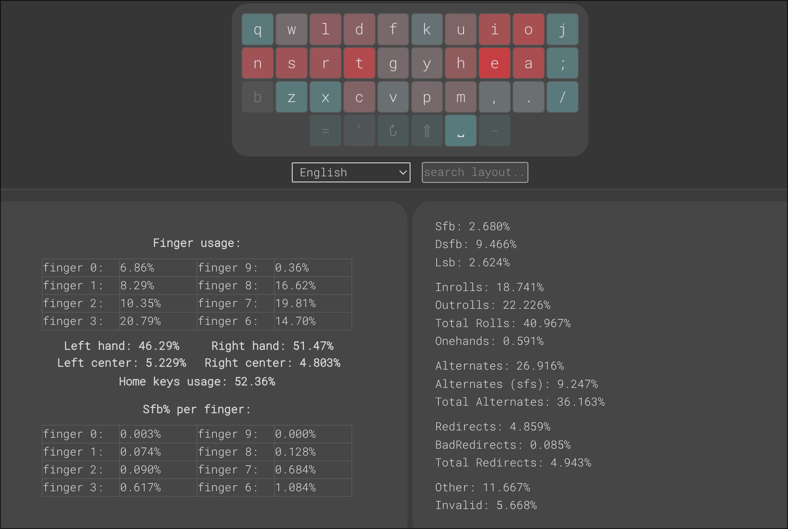

# Qwerty13
Good enough keyboard layout which is similar to Qwerty (only 13 keys change their positions). It uses Angle Mod: `c` - index finger, `x` - middle finger, and `z` - the ring finger.

```
q w l d f  k u i o j [ ]
n s r t g  y h e a ; '
 z x c v b  p m , . /
```



- White (13 letters)- Characters retain their position (relative to Qwerty)
- Green (4 letters) - The letter remains on the same finger of the same hand
- Blue (1 letter) - The letter retains its finger but changes hands
- Yellow (5 letters) - The letter changes fingers but retains its hand
- Red (3 letters) - The letter changes both fingers and hands

13 letters retain their positions; 4 letters retained both their finger and hand positions.

### Qwerty13-punct

```
q w l d f  k u i o j [ ]
n s r t g  y h e a , '
 z x c v b  p m / . ;
```

## The reason for creating Qwerty13

I already stick with my and game layout [Grawerty-punct](https://github.com/mohoaz1348-rgb/grawerty), but I just want to create layout that has maximum (even more then Grawerty) similarity with Qwerty and still has good trigrams and bigrams stats (on the same level this the best modern layouts).

## Comparison this other layouts



### Trigrams

The overall number of redirects are 5% and it increased by 2% compared to Graphite, Gallium, Northstar, Placebo – that's slightly exceed my red flag which I sat to 4% (Grawerty layout has 3.7%). But many modern layouts treat this level of redirects as aceptable (Sturdy, Pine-v4, Nokwts, Eclipse). Canary, Stand has total redirects about 7%.

The number of weak redirects is almost zero - 0.085%. Champion.

So, Qwerty13 solved the worst issue of Qwerty - enormous number of redirects and especially weak redirects. Colemak doesn't solve it.

### Bigrams

Layouts rating in [ABA Analyzer](https://github.com/mohoaz1348-rgb/layout_bigrams_analyzer) (by bigrams type):
```
                         3.0     3.0     3.0     1.5     3.0     0.0     1.0     1.0     2.0     3.0     0.5    0.25     1.0     2.5     0.5     0.5
LAYOUT(mode)             PRS FS(bad) WS(bad) HS(bad)  SFB(P)     SFB SFB(0u) SFB(1u) SFB(2u) SFB(3u) LSB(IM) LSB(IR) LSB(IP)  LSB(P)  R(P-M) R(R->P) Sort By
lazyman(ang)           !0.40    0.01    0.00    0.01    0.15    3.83    2.51    1.20    0.11    0.00    1.40    0.53    0.02    0.11    1.26    0.30    7.53
placebo-ang(ang)       !0.38    0.05    0.00    0.20    0.15    3.69    2.51    1.03    0.15    0.00    0.82    1.55    0.01    0.13    1.53    0.29    7.92
grawerty-punct(ang)     0.09    0.00    0.03    0.20    0.03    4.96    2.51    1.99  2?0.45    0.00    1.61    1.87    0.01    0.11    0.49    0.04    7.97
grawerty(ang)           0.07    0.03    0.03    0.22    0.01    5.06    2.51    2.09  2?0.45    0.00    1.69    1.87    0.01    0.13    0.37    0.02    8.09
canary(ang)            !0.49    0.07    0.02    0.27    0.15    3.44    2.51    0.89    0.04    0.00    1.57    0.77    0.03    0.11    1.21    0.42    8.17
gallium-east(ang)      !0.33    0.05    0.00    0.22    0.15    3.83    2.51    1.17    0.15    0.00    0.76    0.92    0.01    0.11   !2.50    0.48    8.29
placebo-std(std)       !0.38    0.05    0.01    0.37    0.15    3.69    2.51    1.07    0.11    0.00    0.81    1.88    0.08    0.13    1.54    0.29    8.32
QWERTY13-punct(ang)     0.15    0.00    0.03    0.04    0.10    5.18    2.51    1.98  3?0.68    0.01    1.99    0.82    0.02    0.11    0.43    0.04    8.51
QWERTY13(ang)           0.13    0.03    0.03    0.06    0.08    5.28    2.51    2.08  3?0.68    0.01    2.07    0.82    0.02    0.13    0.31    0.02    8.63
gallium-east(std)      !0.34    0.07    0.03    0.36    0.16    3.78    2.51    1.14    0.13    0.00    0.76    0.92    0.01    0.11   !2.58    0.48    8.67
northstar(ang)         !0.43    0.05  2!0.25    0.18    0.10    3.79    2.51    1.09    0.20    0.00    0.78    0.58    0.01    0.13    1.77    0.45    8.74
alt(ang)               !0.33    0.03    0.06    0.01    0.15    3.96    2.51    1.22    0.20    0.04   !3.40    1.63    0.09    0.18    1.01    0.32    9.29
graphite-ang(ang)      !0.39    0.08    0.10   !0.54    0.12    3.48    2.51    0.89    0.09    0.00    0.68    0.70    0.11    0.17  2!4.10    0.35    9.73
focal-ang(ang)        2!0.57    0.06    0.03    0.39   !0.43    3.29    2.51    0.70    0.08    0.00    1.07    1.31    0.00    0.00   !2.70   !0.62    9.75
gallium-v2(std)       2!0.60    0.07   !0.16   !0.59    0.12    3.44    2.51    0.87    0.06    0.00    0.69    0.86    0.00    0.00  2!4.16    0.35   10.05
sturdy-ang(ang)       2!0.54    0.06   !0.15    0.21   !0.43    3.37    2.51    0.74    0.12    0.01    1.94    1.10    0.00    0.00   !2.42   !0.52   10.09
comet(ang)            2!0.53    0.06    0.06    0.20    0.16    3.53    2.51    0.93    0.09    0.00   !3.40    1.57    0.10    0.18    1.80    0.47   10.13
stand(ang)            2!0.71   !0.12    0.04    0.07   !0.60    3.29    2.51    0.68    0.10    0.00    1.28    0.66    0.00    0.01   !2.52   !0.53   10.26
anymak:end(ang)        !0.33   !0.09    0.03    0.27   !0.60    4.08    2.51    1.44    0.13    0.00    1.08    1.44    0.02    0.02  2!4.65   !0.58   11.35
pine_v4(std)          5!1.33   !0.11    0.06    0.20    0.20    3.48    2.51    0.85    0.11    0.02    1.48    1.52    0.05    0.00   !2.02   !0.51   11.48
colemak-dh(ang)       2!0.69   !0.12    0.10    0.18    0.21    3.72    2.51    1.03    0.18    0.00    1.69    1.21    0.06    0.14   !3.34  3!1.52   11.52
beakl19bis(std)         0.22  6!0.55   !0.19    0.32    0.15    3.88    2.51    1.08   ?0.28    0.01    2.07    0.39    0.00    0.03  2!5.11    0.31   11.91
colemak(ang)          2!0.68  2!0.18    0.03    0.06    0.21    4.04    2.51    1.34    0.18    0.00   !3.58    1.58    0.38    0.14   !2.41  3!1.52   12.48
engram(std)           2!0.68  6!0.52   !0.19   !0.62    0.25    4.20    2.51    1.53    0.17    0.00    0.78    0.33    0.01    0.02  2!4.01    0.16   12.85
handsdown-neu(ang)    3!0.81  5!0.47   !0.12   !0.96    0.17    3.83    2.51    1.23    0.09    0.00    0.64    0.14    0.00    0.25  2!4.47    0.01   13.29
colemak(std)          2!0.69   !0.12    0.10   !0.82    0.26    3.75    2.51    1.07    0.17    0.00   !3.58    1.58    0.38    0.14   !3.34  3!1.52   14.00
dvorak(std)           2!0.54    0.08    0.03    0.30  3!1.24    5.21    2.51    2.28   ?0.36   !0.07    1.24    3.18    0.09    0.06   !2.83   !0.67   15.25
qwerty(ang)           3!0.78  2!0.20    0.08    0.04    0.14   !9.33    2.51   !4.35 11?2.25  4!0.22  3!7.52    2.81    0.46    0.10    1.54    0.44   21.84
qwerty(std)           3!0.79 13!1.09   !0.19    0.22    0.18   !9.50    2.51   !4.39 11?2.38  4!0.22  3!7.52    2.81    0.46    0.10   !2.48    0.44   26.03

```
- **PRS** – Pinky/Ring Scissors (Half and Full)
- **FS(bad)** – Full Scissors (only Bad). Good Scissors (Index on buttom row) not included
- **WS(bad)** – Wide Scissors (only Bad)
- **HS(bad)** – Half-Scissors (only Bad). For example `wd`, `dw`, `sc` on Qwerty
- **SFB(P)** – SFB on Pinkies
- **SFB** – All SFB (SFB(0u) included))
- **SFB(3u)** – For example `br`, `my` on Qwerty
- **LSB(IM)** – LSB on Index/Middle. Qwerty `nk` – not LSB on ANSI keyboard. Qwerty `ve` – LSB on Standart and Angle Mode
- **LSB(IR)** – LSB on Index/ Ring. Qwerty `nl` – not LSB on ANSI keyboard. Qwerty `vw` – LSB on Standart and Angle Mode
- **LSB(IP)** – LSBs that require simultaneous stretching of the little finger and index finger. For example `ba`, `ab` on Qwerty
- **LSB(P)** - LSB Pinky/Ring + LSB Pinky/Middle
- **R(P-M)** – Rolls Pinky/Middle
- **R(R→P)** – Roll-out Ring→Pinky
- **Sort By** = sum(k*value)

Layouts rating in [ABA Analyzer](https://github.com/mohoaz1348-rgb/layout_bigrams_analyzer) (by bigrams effort):  
`-3` - most inconvenient bigrams  
`3` - most convenient bigrams
```
                         4.0     2.0     1.0     0.0     0.0     0.0     0.0     0.0     0.0
LAYOUT(mode)              -3      -2      -1       0       1       2       3     alt      NF Sort By
grawerty-punct(ang)     0.13    0.89    5.62    1.35    3.28    8.07   12.12   70.76    0.19    7.92
lazyman(ang)            0.40    0.46    5.44    1.59    4.56    8.74   11.29   69.74    0.19    7.96
canary(ang)             0.44    0.60    5.03    1.70    3.82   10.59   17.52   62.51    0.19    7.99
grawerty(ang)           0.14    0.96    5.64    1.35    3.22    8.03   12.12   70.76    0.19    8.12
alt(ang)                0.46    0.56    5.22    3.56    3.98    6.67   12.63   69.31    0.00    8.18
placebo-ang(ang)        0.40    0.73    5.30    1.55    2.24    8.75   12.48   70.76    0.19    8.36
placebo-std(std)        0.41    0.74    5.53    1.76    2.27    8.45   12.30   70.76    0.19    8.65
QWERTY13-punct(ang)     0.26    1.17    5.47    1.51    4.60    7.43   12.27   69.49    0.19    8.85
QWERTY13(ang)           0.27    1.24    5.49    1.51    4.55    7.38   12.27   69.49    0.19    9.05
comet(ang)              0.59    0.63    5.75    4.06    4.53    7.00   10.73   69.11    0.00    9.37
gallium-east(ang)       0.47    0.60    6.64    1.07    4.52    7.84   10.32   70.76    0.19    9.72
gallium-east(std)       0.53    0.58    6.82    1.02    4.56    7.73   10.22   70.76    0.19   10.10
northstar(ang)          0.51    1.38    5.47    1.28    3.16    9.45   10.20   70.76    0.19   10.27
pine_v4(std)            0.67    1.49    5.46    2.20    3.88    8.72   11.98   67.84    0.19   11.12
sturdy-ang(ang)        !0.97    0.61    6.33    2.12    3.69    9.54   14.46   64.49    0.19   11.43
graphite-ang(ang)       0.52    0.90   !7.99    0.90    2.97    7.52   10.73   70.88    0.00   11.87
focal-ang(ang)         !1.00    0.75    6.39    1.23    4.10    7.34   13.23   68.18    0.19   11.89
gallium-v2(std)         0.74    0.52   !8.16    0.98    3.80    7.31    9.95   70.76    0.19   12.16
stand(ang)             !1.39    0.52    5.67    0.94    2.51    9.36   17.87   63.94    0.19   12.27
colemak(ang)           !1.00    0.54   !7.76    5.35    5.70   10.40   11.34   60.13    0.19   12.84
anymak:end(ang)        !1.04    0.86   !8.44    1.24    3.05    7.22    6.81   73.56    0.19   14.32
colemak-dh(ang)        !0.95   !1.63   !7.30    2.71    6.17    9.95   13.36   60.13    0.19   14.36
colemak(std)           !1.05    0.49   !9.19    5.40    5.64    9.41   10.89   60.13    0.19   14.37
beakl19bis(std)        !0.94    1.22   !8.50    2.28    2.24    6.03    7.47   73.54    0.19   14.70
engram(std)            !1.45    1.19    6.83    1.34    3.69   10.11    7.42   70.32    0.04   15.01
dvorak(std)           2!1.90    0.86   !7.37    1.67    6.22    4.36    7.22   72.80    0.00   16.69
handsdown-neu(ang)     !1.56    1.12   !8.43    1.82    3.22    5.57    6.92   73.71    0.04   16.91
qwerty(ang)           2!1.82   !2.59   !9.78    7.73   12.71   10.74    2.50   54.36    0.19   22.24
qwerty(std)           2!2.35  2!3.19  !10.94    7.73   11.57    9.75    2.31   54.36    0.19   26.72

```
As you can see, Qwerty13 has almost zero bad scissors of all types (PRS - pinky/ring scissors, FS - Full Scissors, WS - Wide Scissors, HS - Half Scissors). It has acceptable level of LSB of all types. And it has the most advanced stats for pinky<->middle rolls and ring->pinky rolls.

Qwerty13 has total level of SFB like Dvorak and Grawerty layouts. For me this is acceptable level. This extra percentage of SFB is quite comfortable to type, as it's concentrated in just a few bigrams on the index and middle fingers. `ie` are comfortable, `ct` is less comfortable, `e,` is awkward, `up`, `pu`, `mu`, `um`, `dg`, `dv` are easy to type using the index and middle fingers - this is quite familiar to Qwerty users.

Overall bigrams rating of Qwerty13 is pretty high - it stands even higher then Graphite (but Graphite has slightly better trigrams stats).

So, Qwerty13 has more similarity with Qwerty then Colemak and has stats on the same level with the best modern layouts. 
